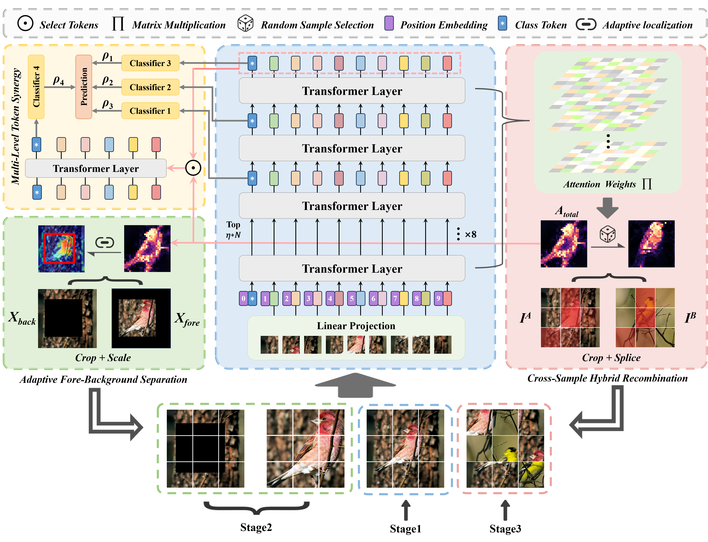

# Multi-Stage Fine-Grained Vision Classification Method via Attentional Crop-Mixing and Cross-Region Contrast

PyTorch code for the paper:  *Multi-Stage Fine-Grained Vision Classification Method via Attentional Crop-Mixing and Cross-Region Contrast*

## Framework



## Dependencies:

+ python 3.10.0
+ PyTorch 2.3.0
+ torchvision 0.18.0
+ ml_collections 0.1.1
+ numpy 2.1.1
+ pandas 2.2.2
+ scipy 1.14.1
+ timm 1.0.15
+ Pillow 10.4.0
+ tqdm 4.66.5


## Usage

### 1. Download Google pre-trained ViT models

We use ViT-B_16 as the backbone. The official download link for pretrained weight [https://storage.googleapis.com/vit_models/sam/ViT-B_16.npz](https://storage.googleapis.com/vit_models/sam/ViT-B_16.npz).

### 2. Prepare data

In the paper, we use images from there publicly available datasets:

+ [CUB-200-2011](http://www.vision.caltech.edu/visipedia/CUB-200-2011.html)
+ [Stanford Dogs](http://vision.stanford.edu/aditya86/ImageNetDogs/)
+ [NABirds](http://dl.allaboutbirds.org/nabirds)

Please download them from the official websites and put them in the corresponding folders.

In order to read datasets in a unified approach, we use CSV files to read data. Please organize the train set and test set into the following forms:

|      | img_name                                                     | label |
| ---- | ------------------------------------------------------------ | ----- |
| 0    | 001.Black_footed_Albatross/Black_Footed_Albatross_0009_34.jpg | 1     |
| 1    | 001.Black_footed_Albatross/Black_Footed_Albatross_0074_59.jpg | 1     |
| ...  | ...                                                          | ...   |
| 5993 | 200.Common_Yellowthroat/Common_Yellowthroat_0049_190708.jpg  | 200   |

Note:

- The label of categories starts from 1 not 0.
- The order of each image does not matter.

### 3. Install required packages

Install dependencies with the following command:

```bash
pip install -r requirements.txt
```

### 4. Train

You can modify the configuration in the `config.py` file and run it directly:

```bash
python main.py
```

### 5 Validate

After model training, you will get the weight in the checkpoints folder. You can modify the configuration in  the `config.py` file and run it directly:

```bash
python val.py
```


